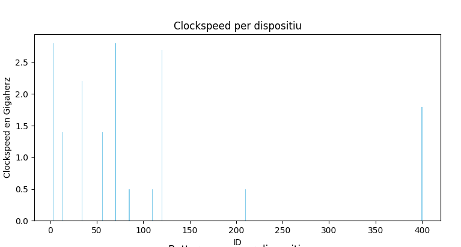
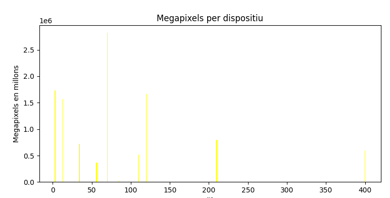
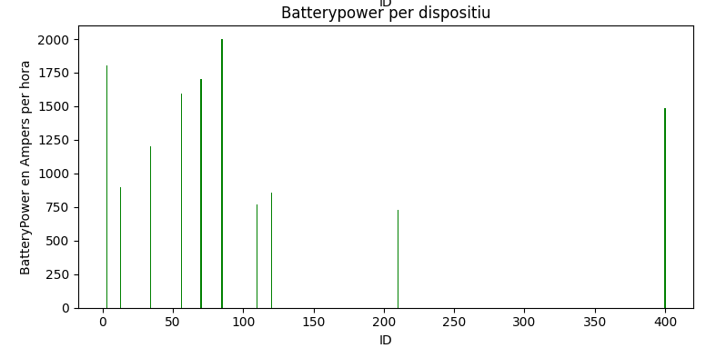
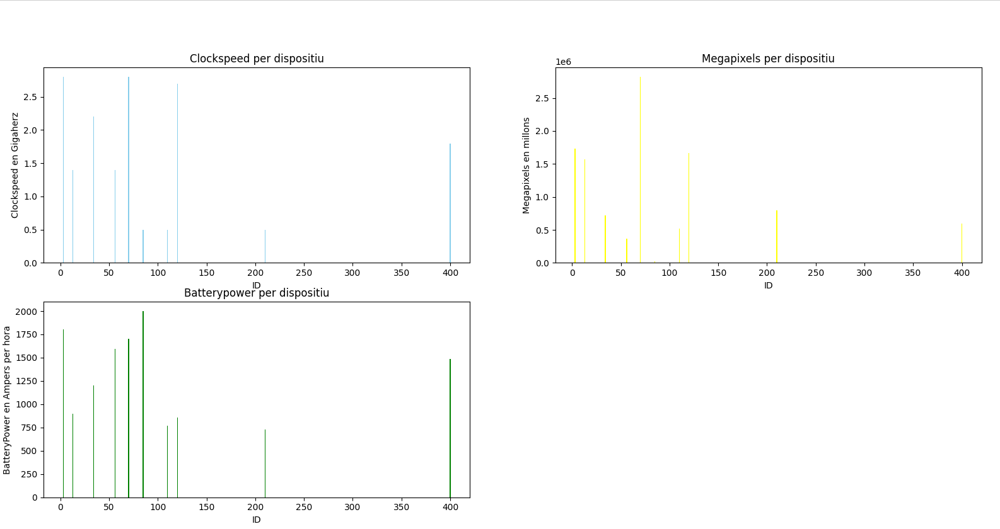

<h1>Grafics de barres Exercici C</h1>

<h2>Clockspeed<h2>
<h3>Eix X el ID del dispositiu</h3>
<h3>Eix Y el ClockSpeed del dispositiu<h3>

<h2>Megapixels<h2>
<h3>Eix X el ID del dispositiu</h3>
<h3>Eix Y els Megapixels del dispositiu<h3>

<h2>Batterypower<h2>
<h3>Eix X el ID del dispositiu</h3>
<h3>Eix Y la BatteryPower del dispositiu<h3>

<h2>Total<h2>
<h3>Resultat total<h3>
