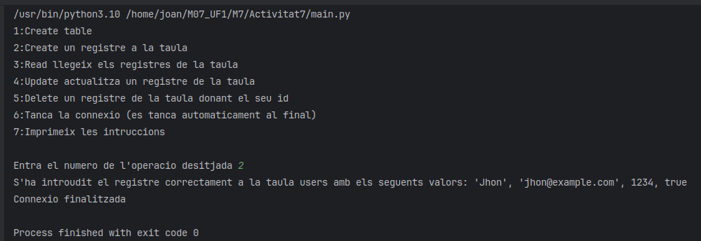
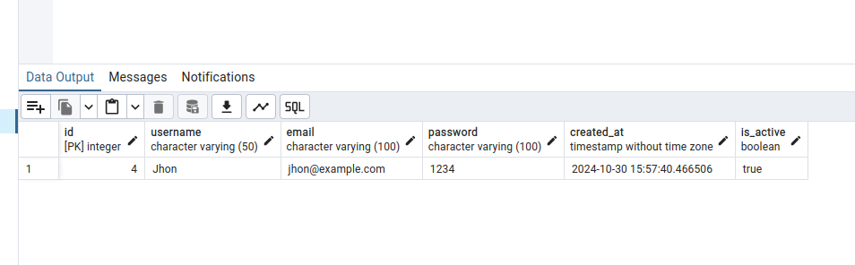
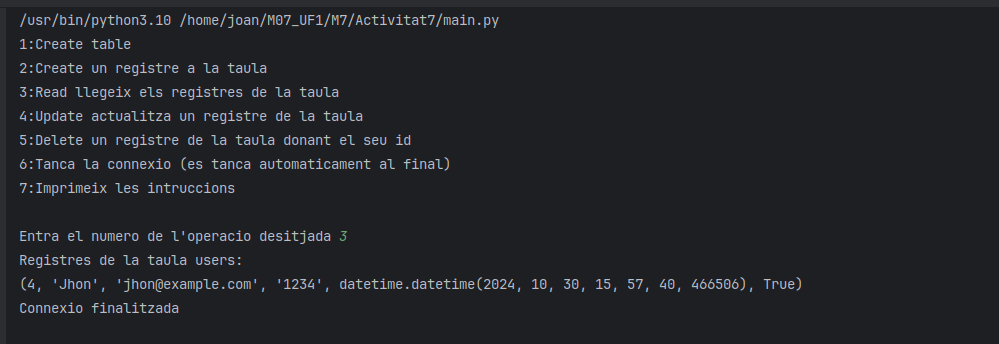
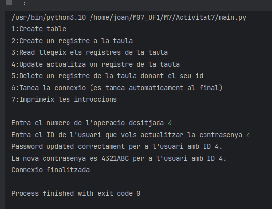
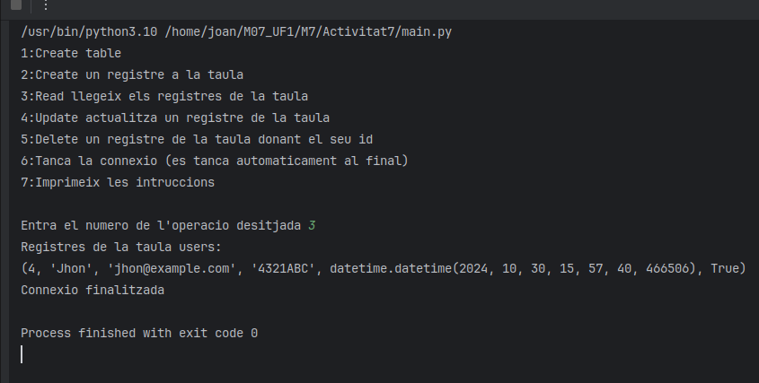
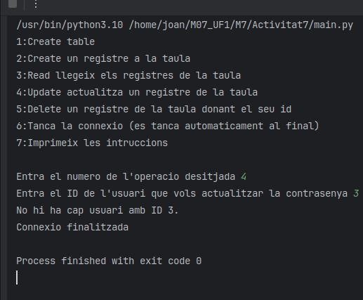
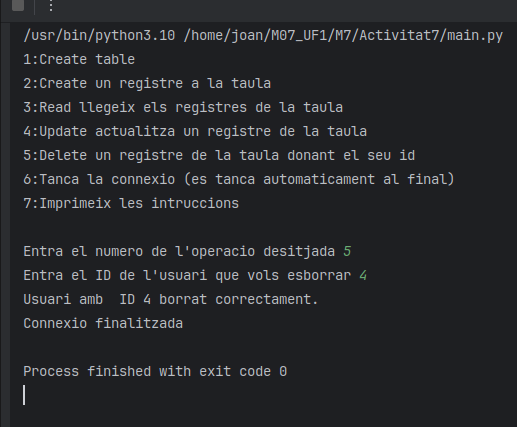
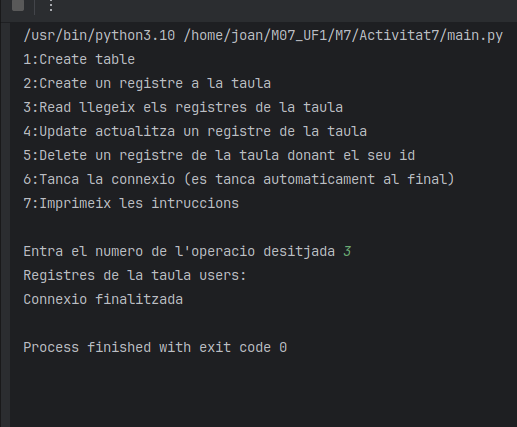

<h1>Documentació i captures del projecte</h1>

<h2>Create</h2>

Es una funció per a crear un registre a la taula users amb els seguents valors 'Jhon', 'jhon@example.com', 1234, true  La taula te un ID autoincrement i uns camps que es generen automaticament.

<h2>Read</h2>

Es una funció que llegeix tots els registres de la taula users i els mostra per pantalla linia per linia No te molt de misteri es un select * from users i fa un fetch dels resultats per columnes i després els mostra

<h2>Update</h2>

Funcio que actualitza la contrasenya d'un usuari de la taula users donat el seu ID la contrasenya que nova que se l'hi assigna a l'usuari és 4321ABC Si no hia cap usuari amb l'ID donat el programa t'informa del que ha passat i no fa update de res

<h2>Delete</h2>

Funcio que esborra un usuari de la taula users donat el seu ID. Si no hi ha cap usuari amb aquest ID el programa avisa a l'usuari i no esborra res

